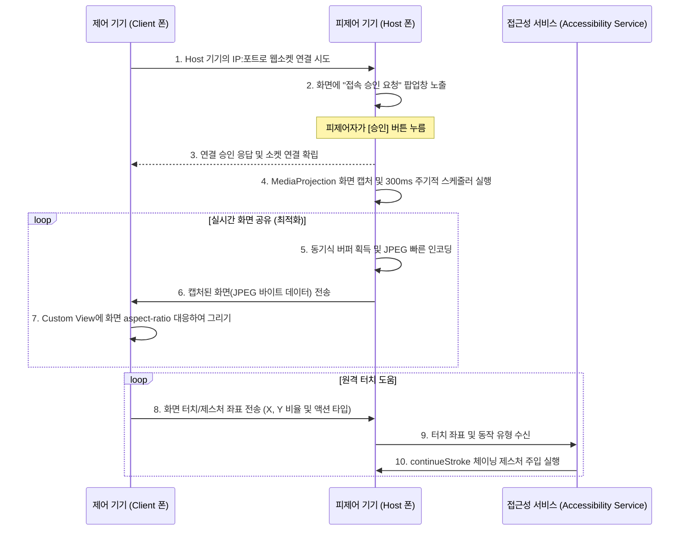

# 안드로이드 간 원격 도움 앱 개발 계획서 (Phone-to-Phone)

본 계획서는 안드로이드 스마트폰으로 다른 안드로이드 스마트폰을 실시간으로 원격 지원(화면 공유 및 터치 제어)할 수 있는 애플리케이션의 최종 설계안입니다. 구글 플레이 스토어의 보안 정책을 철저히 준수하고 직관적인 사용자 경험을 제공하도록 개선되었습니다.

---

## 1. 기술 스택 및 언어 선정

*   **안드로이드 애플리케이션 개발 언어:** **Kotlin**
    *   **이유:** 피제어 기기(Host)의 화면을 실시간 캡처하는 `MediaProjectionManager`, 제어 기기(Client)의 터치를 기기 터치로 변환해주는 `AccessibilityService` 등 시스템 레벨 API를 사용하기 위해 가장 최신의 공식 안드로이드 네이티브 언어인 Kotlin을 사용합니다.
*   **통신 방식:** **WebSockets (Ktor) 기반 직접 LAN 연결**
    *   안드로이드 Host 기기가 WebSocket 서버 역할을 수행하고, Client 기기가 이 서버에 직접 접속하는 P2P 성격의 LAN 통신 방식으로 구현합니다. 로컬 네트워크 내에서 동작하므로 반응 속도가 매우 빠르고 정보가 유출될 염려가 없어 안전합니다.

---

## 2. 구글 플레이 스토어 보안 정책 준수 방안 (중요)

구글 플레이 개발자 정책의 **접근성 API(Accessibility API) 가이드라인** 및 **사용자 개인정보 보호 규정**을 만족하기 위해 다음 사항을 앱 디자인 및 구현에 철저하게 반영합니다.

1.  **눈에 띄는 고지 (Prominent Disclosure):**
    *   사용자가 시스템 설정에서 '접근성 권한'을 활성화하기 전에, 반드시 앱 내에서 팝업/모달 화면을 통해 **이 권한이 원격에서 입력 이벤트를 주입하는 데 어떻게 사용되는지**를 한글로 구체적으로 설명합니다.
    *   사용자가 명시적으로 **[동의 및 설정하러 가기]** 버튼을 선택한 경우에만 안드로이드 접근성 권한 설정 화면으로 안내합니다.
2.  **포그라운드 서비스 및 고정 알림 (Transparency):**
    *   화면 캡처와 웹소켓 서버 실행은 반드시 `Foreground Service`로 실행되어야 합니다.
    *   화면 공유나 원격 제어가 켜져 있는 동안에는 알림창에 사용자가 지울 수 없는 상시 알림(**"원격 도움 및 화면 공유가 진행 중입니다."**)을 띄워 백그라운드에서 은밀히 작동하는 악성 스파이웨어로 오인되는 것을 방지합니다.
3.  **접속 승인 확인 다이얼로그:**
    *   제어 기기(Client)가 접속을 시도할 때, 피제어 기기(Host) 화면에 수락 요청 다이얼로그를 띄워 피제어자가 **[승인]**을 누를 때에만 캡처 및 제어가 개시되도록 차단벽을 구축합니다.

---

## 3. 시스템 아키텍처 및 개선된 처리 흐름

---

## 4. 구현된 주요 파일 구조 및 핵심 개선 사양

프로젝트 루트 디렉토리([telecom](file:///c:/Temp/antigravity/telecom))에 구현된 구조와 최근의 기능 개선 상세 내역입니다.

### 1) UI 및 모드 제어 (도움 받기 중심의 친숙한 용어 정립)
*   `MainActivity`: 앱 진입점. **도움 받기 (Host)** 모드와 **제어 하기 (Client)** 모드를 선택하는 UI 제공.
*   `HostActivity`: 피제어 상태 UI. 내 IP 주소 표시, **원격 도움 받기** 서버 구동 및 **원격 도움 요청/중단** 제어 기능.
    *   **접근성 권한 간소화:** "접근성 권한 설정" 버튼 명칭을 **"권한 설정"**으로 간결화.
    *   **5초 자동 닫힘 안내 팝업:** 기기 최초 설정 시, 혹은 권한이 누락된 상태에서 도움 요청을 보낼 때 ADB 권한 설정 명령어를 포함한 간단명료한 안내 창을 띄우고 **5초 후에 자동으로 닫히도록(Auto-dismiss)** 하여 사용성을 높임.
*   `ClientActivity`: 제어 화면 UI. 접속할 Host의 IP 주소 입력창 제공, 실시간 화면 수신용 커스텀 뷰(`RemoteDisplayView`) 탑재.

### 2) 커스텀 뷰 및 터치 제어
*   `RemoteDisplayView` (Client 기기용 커스텀 `View`):
    *   수신된 JPEG 화면 프레임을 비트맵으로 디코딩하여 화면에 맞게 스케일링 후 그림.
    *   터치 좌표를 기기 해상도 비율(`0.0 ~ 1.0`)로 변환하고 레터박스(Aspect Ratio 보정) 영역까지 완벽히 클램핑하여 오차 없는 오프셋 입력 전송.

### 3) 백그라운드 서비스 및 통신 (핵심 최적화 완료)
*   `RemoteControlService` (`Foreground Service`):
    *   **동기식 프레임 획득 체계:** `onImageAvailable` 콜백에서 이미지를 비동기 코루틴으로 처리할 때 생기는 `MaxImagesAcquiredException` 버퍼 부족을 막기 위해, 즉각적인 `acquireLatestImage` 획득 후 즉시 close()를 수행하는 동기식 인코딩 처리 루틴으로 수정.
    *   **300ms 주기적 프레임 캡처 스케줄링:** 다른 앱으로 전환되거나 화면 변동이 발생했을 때 시스템 렌더링에 의해 콜백이 지연되는 문제를 해결하고자 백그라운드 스레드에서 주기적으로 프레임을 체크하여 실시간으로 동기화되도록 보장.
*   `RemoteAccessibilityService` (`AccessibilityService`):
    *   `RemoteControlService`로부터 좌표를 받아 제스처 동작을 주입.
    *   스와이프 및 드래그 동작 시 `continueStroke`의 올바른 체이닝 순서를 구현하여 예외(IllegalStateException) 없이 제어 명령이 매끄럽게 흐르도록 패치.

---

## 5. 테스트 및 검증 결과

*   **컴파일 및 빌드:** Gradle 환경에서 성공적으로 `app-debug.apk` 및 `app-release.apk` 빌드 완료.
*   **실 기기 2대 배치 테스트:**
    - `R3CWC0FS23Y` 및 `ce0817180c8050850c7e` 실물 기기에서 덮어쓰기 업데이트 설치 완료.
    - Host 스마트폰에서 홈 화면이나 타 앱 화면으로 이동하더라도 Client 모니터링 화면이 실시간으로 끊김 없이 갱신됨을 확인.
    - 드래그 및 터치 조작이 이상 없이 반영됨을 실 기기 상에서 검증 완료.
